# Kubernetes Hands-On Lab: Namespaced Apache Web App

A beginner-friendly, step-by-step lab for deploying an Apache (`httpd`) web
application inside its own Kubernetes namespace, configured with a
ConfigMap and Secret, exposed via a Service, and constrained by a
ResourceQuota. You will also practice scaling, rolling updates, and
rollbacks.

## Scenario

Your company is deploying a simple Apache web application for the
Development Team. You need to:
1. Isolate it inside a namespace
2. Configure it using a ConfigMap and a Secret
3. Expose it with a Service
4. Ensure it uses limited (bounded) resources
5. Practice scaling, updating, and rolling back the deployment safely

---

## Prerequisites

Before you start, make sure you have:

- A working Kubernetes cluster. Any of these work fine for practice:
  - [Minikube](https://minikube.sigs.k8s.io/) (`minikube start`)
  - [Kind](https://kind.sigs.k8s.io/) (`kind create cluster`)
  - Docker Desktop's built-in Kubernetes
  - A cloud cluster (EKS, GKE, AKS)
- `kubectl` installed and pointed at that cluster.
- A terminal you can take screenshots from.

**Check your setup before starting:**

```bash
kubectl version --short
kubectl get nodes
```

You should see your cluster's version info and at least one node in
`Ready` state.

> `kubectl get nodes` showing a Ready node.

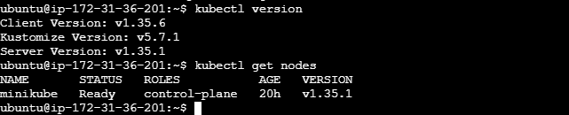

---

## Folder Structure

Throughout this lab you will create small YAML files. Organize them like
this so things stay tidy:

```
k8s-lab/
├── namespace.yaml
├── resourcequota.yaml
├── configmap.yaml
├── secret.yaml
├── deployment.yaml
└── service.yaml
```

Create the folder now:

```bash
mkdir k8s-lab && cd k8s-lab
```

---

## Task 1: Create a Namespace

**Why:** A namespace is a virtual cluster inside your cluster. It keeps
the Development team's resources (pods, services, configs) separate from
everything else, so names don't clash and access/quotas can be managed
per team.

### Step 1.1 — Create the namespace YAML

Create a file named `namespace.yaml`:

```yaml
apiVersion: v1
kind: Namespace
metadata:
  name: dev-webapp
  labels:
    team: development
    environment: dev
```

### Step 1.2 — Apply it

```bash
kubectl apply -f namespace.yaml
```

### Step 1.3 — Verify

```bash
kubectl get namespaces
kubectl describe namespace dev-webapp
```

> You should see `dev-webapp` listed with status `Active`.

> **Tip:** From here on, every command needs to target this namespace.
> You can either add `-n dev-webapp` to every command, or set it as your
> default context so you don't have to type it each time:
> ```bash
> kubectl config set-context --current --namespace=dev-webapp
> ```

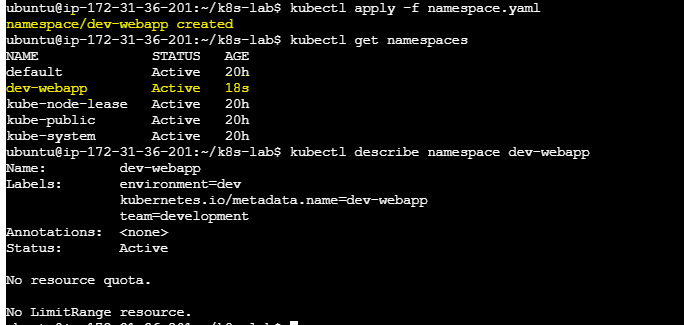

---

## Task 2: Create a ResourceQuota

**Why:** A ResourceQuota limits the total amount of CPU, memory, and
number of objects (pods, services, etc.) that can be created inside a
namespace. This prevents one team's namespace from consuming the whole
cluster's resources.

### Step 2.1 — Create the ResourceQuota YAML

Create a file named `resourcequota.yaml`:

```yaml
apiVersion: v1
kind: ResourceQuota
metadata:
  name: dev-webapp-quota
  namespace: dev-webapp
spec:
  hard:
    pods: "10"
    requests.cpu: "2"
    requests.memory: 2Gi
    limits.cpu: "4"
    limits.memory: 4Gi
    services: "5"
    configmaps: "10"
    secrets: "10"
```

**What each line means (plain English):**
- `pods: "10"` — at most 10 pods can exist in this namespace at once.
- `requests.cpu` / `requests.memory` — the total CPU/memory that all
  pods can *request* (reserve) is capped.
- `limits.cpu` / `limits.memory` — the total CPU/memory that all pods
  can *use at maximum* is capped.
- `services`, `configmaps`, `secrets` — caps on how many of these
  objects can exist in the namespace.

### Step 2.2 — Apply it

```bash
kubectl apply -f resourcequota.yaml
```

### Step 2.3 — Verify

```bash
kubectl get resourcequota -n dev-webapp
kubectl describe resourcequota dev-webapp-quota -n dev-webapp
```

The output shows each resource type, its hard limit, and how much is
currently used (should be `0` for everything right now, since we
haven't deployed anything yet).

> `kubectl describe resourcequota` output showing limits.

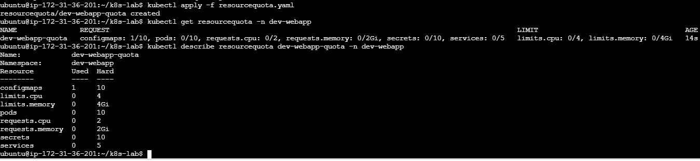

---

## Task 3: Create a ConfigMap

**Why:** A ConfigMap stores non-sensitive configuration data (like a
custom HTML page or config file) separately from your application code
or image. This lets you change configuration without rebuilding your
container image.

We'll use the ConfigMap to inject a custom `index.html` so our Apache
server shows a custom welcome page instead of the default one.

### Step 3.1 — Create the ConfigMap YAML

Create a file named `configmap.yaml`:

```yaml
apiVersion: v1
kind: ConfigMap
metadata:
  name: apache-config
  namespace: dev-webapp
data:
  index.html: |
    <!DOCTYPE html>
    <html>
      <head><title>Dev Team Web App</title></head>
      <body>
        <h1>Hello from the Development Team's Apache Pod!</h1>
        <p>This page was served using a ConfigMap-mounted index.html.</p>
      </body>
    </html>
```

**What this does:** the `data` section holds key-value pairs. Here the
key is `index.html` and the value is the full HTML content. When we
mount this ConfigMap into the pod later, Kubernetes will create a real
file called `index.html` inside the container with this exact content.

### Step 3.2 — Apply it

```bash
kubectl apply -f configmap.yaml
```

### Step 3.3 — Verify

```bash
kubectl get configmap -n dev-webapp
kubectl describe configmap apache-config -n dev-webapp
```

You should see the `index.html` key listed along with its content.

> `kubectl describe configmap apache-config` output.

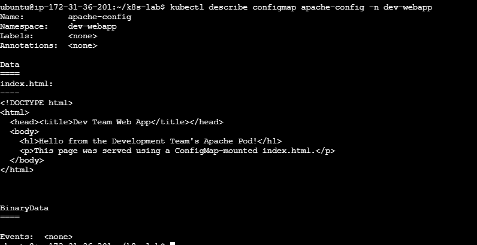

---

## Task 4: Create a Secret

**Why:** A Secret stores sensitive data (passwords, API keys, tokens)
separately from your application, base64-encoded and access-controlled.
Never put passwords directly in a ConfigMap or your Deployment YAML.

We'll create a Secret simulating basic auth credentials for an admin
status page (not actually wired into Apache auth in this lab — the goal
is to practice creating and mounting a Secret).

### Step 4.1 — Create the Secret imperatively

Using `kubectl create secret` is easier than hand-encoding base64
yourself, because kubectl does the encoding for you:

```bash
kubectl create secret generic apache-secret \
  --namespace=dev-webapp \
  --from-literal=admin-user=admin \
  --from-literal=admin-password='<password>'
```

> **Alternative (declarative YAML):** if you prefer a YAML file for
> consistency with the other tasks, you can base64-encode values as below. Create secret.yaml
>
> ```yaml
> apiVersion: v1
> kind: Secret
> metadata:
>   name: apache-secret
>   namespace: dev-webapp
> type: Opaque
> stringData:
>   admin-user: admin
>   admin-password: <password>
> ```
> (`stringData` lets you write plain text — Kubernetes encodes it for
> you automatically, unlike `data` which requires pre-encoded base64.)

### Step 4.2 — Verify

```bash
kubectl get secrets -n dev-webapp
kubectl describe secret apache-secret -n dev-webapp
```

Notice `describe` shows the secret's keys but **not** their values —
that's Kubernetes protecting sensitive data from being casually printed.

> `kubectl describe secret apache-secret` output.

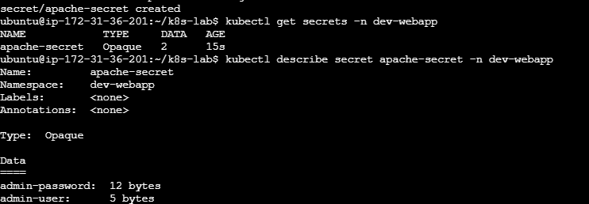

---

## Task 5: Create a Deployment

**Why:** A Deployment manages a set of identical pods, keeps them
running, and lets you update or scale them safely. Here we'll run
Apache (`httpd`), mount our ConfigMap as the web page, mount our Secret
as environment variables, and set resource requests/limits so it
respects the quota from Task 2.

### Step 5.1 — Create the Deployment YAML

Create a file named `deployment.yaml`:

```yaml
apiVersion: apps/v1
kind: Deployment
metadata:
  name: apache-deployment
  namespace: dev-webapp
  labels:
    app: apache-webapp
spec:
  replicas: 3
  selector:
    matchLabels:
      app: apache-webapp
  template:
    metadata:
      labels:
        app: apache-webapp
    spec:
      containers:
        - name: apache
          image: httpd:2.4.54
          ports:
            - containerPort: 80
          resources:
            requests:
              cpu: "100m"
              memory: "128Mi"
            limits:
              cpu: "250m"
              memory: "256Mi"
          env:
            - name: ADMIN_USER
              valueFrom:
                secretKeyRef:
                  name: apache-secret
                  key: admin-user
            - name: ADMIN_PASSWORD
              valueFrom:
                secretKeyRef:
                  name: apache-secret
                  key: admin-password
          volumeMounts:
            - name: html-volume
              mountPath: /usr/local/apache2/htdocs/
      volumes:
        - name: html-volume
          configMap:
            name: apache-config
```

**What each part means:**
- `replicas: 3` — run 3 identical copies (pods) of this Apache
  container.
- `selector` / `labels` — how the Deployment finds and manages "its"
  pods (they must match).
- `image: httpd:2.4.54` — the official Apache HTTP Server image,
  version 2.4.54. We're pinning a version now so we have something
  concrete to update to later (Task 8).
- `resources.requests` — the minimum CPU/memory guaranteed to each pod.
- `resources.limits` — the maximum CPU/memory each pod is allowed to
  use. These numbers must fit inside the ResourceQuota from Task 2
  (3 pods × 250m CPU = 750m, well under our 4-core limit).
- `env` from `secretKeyRef` — injects our Secret's values as
  environment variables inside the container, without ever writing the
  password in plain text in this file.
- `volumeMounts` + `volumes` — mounts our ConfigMap's `index.html` file
  into Apache's web root (`/usr/local/apache2/htdocs/`), so Apache
  serves our custom page instead of its default one.

### Step 5.2 — Apply it

```bash
kubectl apply -f deployment.yaml
```

### Step 5.3 — Verify

```bash
kubectl get deployments -n dev-webapp
kubectl get pods -n dev-webapp
kubectl get pods -n dev-webapp -o wide
```

Wait until all 3 pods show `STATUS: Running` and `READY: 1/1`. This may
take 10-30 seconds while the image is pulled.

To confirm the ConfigMap page is actually being served, port-forward
into one pod and curl it:

```bash
kubectl port-forward -n dev-webapp deployment/apache-deployment 8080:80
```

In a **second terminal window**:

```bash
curl http://localhost:8080
```

You should see the custom HTML from Task 3 ("Hello from the
Development Team's Apache Pod!"). Press `Ctrl+C` in the first terminal
to stop port-forwarding when done.

> `kubectl get pods -n dev-webapp` showing 3 Running pods,
plus the curl output showing your custom page.

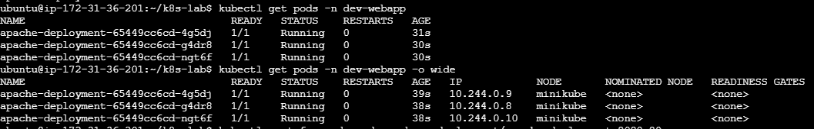
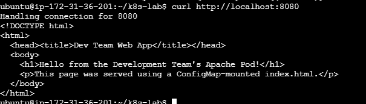

---

## Task 6: Create a Service
 
**Why:** Pods are ephemeral and get new IPs when recreated. A Service
gives them a stable network address and load-balances traffic across
all matching pods, so other apps (or you) can reach Apache reliably.
We'll use `NodePort` specifically so the app can also be reached from
outside the cluster — e.g. a browser — not just from other pods.
 
### Step 6.1 — Create the Service YAML
 
Create a file named `service.yaml`:
 
```yaml
apiVersion: v1
kind: Service
metadata:
  name: apache-service
  namespace: dev-webapp
spec:
  type: NodePort
  selector:
    app: apache-webapp
  ports:
    - port: 80
      targetPort: 80
      nodePort: 30080
      protocol: TCP
```
 
**What each part means:**
- `type: NodePort` — opens this Service on a fixed port (`30080`) on
  every node in the cluster, so it's reachable from **outside** the
  cluster — including your browser — without needing
  `kubectl port-forward`.
- `selector: app: apache-webapp` — this must match the pod template's
  labels from Task 5, so the Service knows which pods to send traffic
  to.
- `port: 80` — the port the Service itself listens on, for traffic
  *inside* the cluster.
- `targetPort: 80` — the port on the pod to forward traffic to (matches
  `containerPort` in the Deployment).
- `nodePort: 30080` — the port opened on each node's IP for traffic
  from *outside* the cluster. Kubernetes restricts NodePort values to
  the range `30000-32767` by default (configurable by a cluster admin,
  but this is the standard default) — so a port like `8080` is
  rejected; `30080` is simply a memorable number inside the allowed
  range. If you leave `nodePort` out entirely, Kubernetes auto-assigns
  a free port from that range for you.
> **Note — internal-only access:** if you don't need browser access and
> only want the app reachable from *inside* the cluster (the more
> common, more secure setup for internal or backend services), use
> `type: ClusterIP` instead of `NodePort`, and drop the `nodePort` line
> entirely:
> ```yaml
> spec:
>   type: ClusterIP
>   selector:
>     app: apache-webapp
>   ports:
>     - port: 80
>       targetPort: 80
>       protocol: TCP
> ```
> With `ClusterIP` you'd reach the app only via `kubectl port-forward`
> (as used in Task 5) or from another pod inside the cluster — never
> directly from your browser. `ClusterIP` is also the Kubernetes
> default if you omit `type` altogether.
 
### Step 6.2 — Apply it
 
```bash
kubectl apply -f service.yaml
```
 
### Step 6.3 — Access it from your browser
 
**Why NodePort at all?** The whole point of `NodePort` is to let you
reach the app from *outside* the cluster — e.g. a browser on your
laptop — without running `kubectl port-forward` every time. It does
this by opening the same fixed port (`30080`) on every node's own IP
address, so `<node-ip>:30080` is reachable directly, the same way any
normal web server on that machine would be.
 
**Does that mean port-forward is never needed with NodePort?**
Normally, no — that's the tradeoff:
 
| Service type | Reachable from | Needs `kubectl port-forward`? |
|---|---|---|
| `ClusterIP` | Only inside the cluster (other pods) | **Yes, always** — it's the only way in from outside |
| `NodePort` | `<node-ip>:<nodePort>`, from outside the cluster | **No, normally** — that's its whole purpose |
| `NodePort` on Minikube running *inside a cloud VM* (see below) | Only Minikube's internal Docker network | **Yes** — see why below |
 
**The one common exception — Minikube on a cloud VM (e.g. EC2):**
Minikube runs as its own isolated node *inside a Docker container* on
your EC2 machine, with a private internal IP (something like
`192.168.49.2`), not on the EC2 host's real network interface. So even
though the Service correctly opens `30080` on the Minikube node, that
node isn't your EC2 machine's actual public interface — it's one
network layer deeper, invisible from the internet no matter what your
EC2 security group allows. In this specific setup, NodePort alone
isn't enough, and you fall back to port-forwarding — but bound to all
interfaces, not just localhost, so the EC2 host itself exposes it
externally:
 
```bash
kubectl port-forward --address 0.0.0.0 -n dev-webapp svc/apache-service 8081:80
```
 
Then open port `8081` (not `30080`) in your EC2 security group, and
visit:
```
http://<ec2-public-ip>:8081
```
Leave that port-forward command running the whole time you're testing.

> 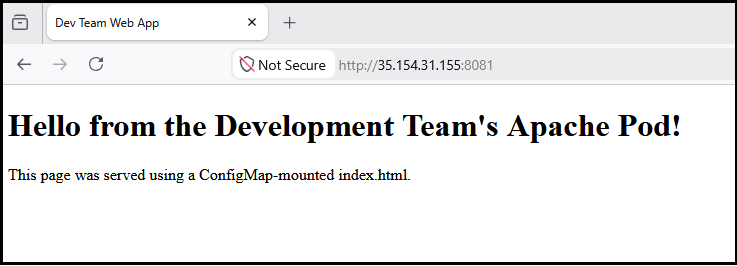
 
**How to access it in other setups:**
 
- **Minikube on your own laptop (not a cloud VM):**
```bash
  minikube service apache-service -n dev-webapp
```
  Minikube runs its own local network directly reachable from your
  laptop's browser here, so this opens it (or prints the URL) with no
  extra steps.

 
### Step 6.4 — Verify
 
```bash
kubectl get services -n dev-webapp
kubectl describe service apache-service -n dev-webapp
```
 
Check that `Endpoints` in the describe output lists 3 pod IPs (one per
replica) — this confirms the Service found and is routing to your pods.

> `kubectl describe service apache-service` showing
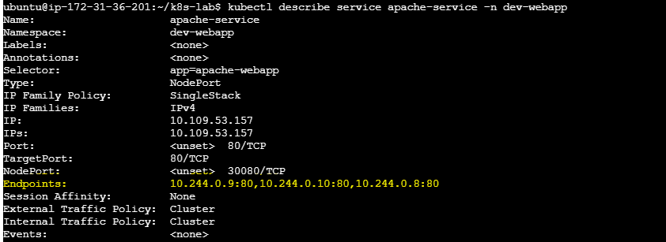

---

## Task 7: Scale the Deployment (3 → 5 replicas)

**Why:** Scaling lets you handle more traffic by running more copies of
your pod. Kubernetes makes this a single command.

### Step 7.1 — Scale up

```bash
kubectl scale deployment apache-deployment -n dev-webapp --replicas=5
```

### Step 7.2 — Verify

```bash
kubectl get deployment apache-deployment -n dev-webapp
kubectl get pods -n dev-webapp -l app=apache-webapp
```

You should now see `5/5` ready in the Deployment, and 5 pods listed,
all `Running`.

> **Watch it happen live (optional):** run this in a separate terminal
> right after scaling, and watch new pods appear:
> ```bash
> kubectl get pods -n dev-webapp -w
> ```
> Press `Ctrl+C` to stop watching.

> `kubectl get pods -n dev-webapp` showing 5 Running pods.

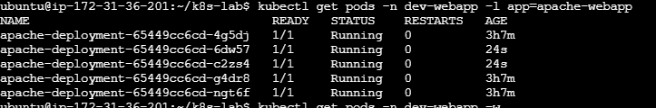

---

## Task 8: Rollout Update (image version change)

**Why:** In real projects, you regularly ship new versions of your app.
Kubernetes Deployments perform this as a **rolling update** — replacing
old pods with new ones gradually, with zero downtime, instead of
killing everything at once.

### Step 8.1 — Update the image

We'll update from `httpd:2.4.54` to `httpd:2.4.58`:

```bash
kubectl set image deployment/apache-deployment \
  apache=httpd:2.4.58 -n dev-webapp
```

> `apache` here is the **container name** we set in `deployment.yaml`
> (`name: apache`), not the image name — `kubectl set image` needs
> `<container-name>=<new-image>`.

### Step 8.2 — Check rollout status

```bash
kubectl rollout status deployment/apache-deployment -n dev-webapp
```

This command blocks and shows live progress until the rollout finishes,
ending with something like:
`deployment "apache-deployment" successfully rolled out`.

### Step 8.3 — View rollout history

```bash
kubectl rollout history deployment/apache-deployment -n dev-webapp
```

You'll see a numbered list of revisions (e.g. `REVISION 1`, `REVISION
2`). Revision 1 is your original `httpd:2.4.54` deployment; revision 2
is this update.

To see exactly what changed in a specific revision:

```bash
kubectl rollout history deployment/apache-deployment -n dev-webapp --revision=2
```

### Step 8.4 — Confirm the new image is running

```bash
kubectl get pods -n dev-webapp -o jsonpath='{.items[*].spec.containers[*].image}'
echo
```

All pods should now show `httpd:2.4.58`.

> `kubectl rollout status` and `kubectl rollout history`
output.

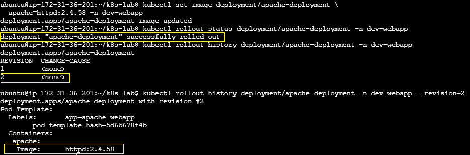

---

## Task 9: Rollback

**Why:** If a new version has a bug, you need to revert quickly.
Kubernetes keeps a revision history precisely so you can undo an update
in one command.

### Step 9.1 — Roll back to the previous version

```bash
kubectl rollout undo deployment/apache-deployment -n dev-webapp
```

This reverts to the revision immediately before the current one (our
original `httpd:2.4.54`).

> **Rolling back to a specific revision:** if you have more than two
> revisions and want to go back further than "one step", target it
> directly:
> ```bash
> kubectl rollout undo deployment/apache-deployment -n dev-webapp --to-revision=1
> ```

### Step 9.2 — Check rollout status

```bash
kubectl rollout status deployment/apache-deployment -n dev-webapp
```

### Step 9.3 — Verify the image version reverted

```bash
kubectl get pods -n dev-webapp -o jsonpath='{.items[*].spec.containers[*].image}'
echo
```

All pods should now show `httpd:2.4.54` again.

Check the history again — the rollback itself creates a new revision
entry:

```bash
kubectl rollout history deployment/apache-deployment -n dev-webapp
```

> `kubectl get pods -o jsonpath=...` confirming the
image is back to `httpd:2.4.54`.

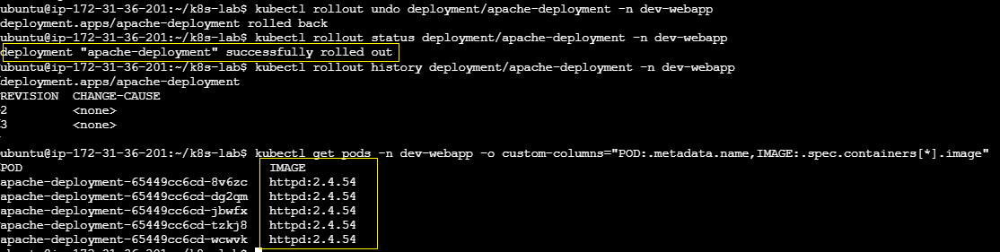

---

## Task 10: Verify Everything

**Why:** A final sanity check that every object from this lab exists,
is healthy, and is correctly scoped inside `dev-webapp`. This is also
good practice for how you'd document/verify a real deployment for a
handover or an audit.

Run each of these and review the output:

```bash
# Namespace
kubectl get namespace dev-webapp

# Pods
kubectl get pods -n dev-webapp -o wide

# Deployments
kubectl get deployments -n dev-webapp

# ReplicaSets
kubectl get replicasets -n dev-webapp

# Services
kubectl get services -n dev-webapp

# ConfigMap
kubectl get configmap -n dev-webapp

# Secret
kubectl get secrets -n dev-webapp

# ResourceQuota
kubectl get resourcequota -n dev-webapp
```

**Tip:** for a single combined view, you can also run:

```bash
kubectl get all,configmap,secret,resourcequota -n dev-webapp
```

**What to check for:**
- Namespace `dev-webapp` is `Active`.
- 5 pods are `Running` and `1/1` ready, all on image `httpd:2.4.54`.
- Deployment shows `5/5` ready.
- Two or more ReplicaSets exist (one per revision) — only the current
  one should have pods; old ones show `0` desired/current.
- Service `apache-service` has 5 endpoints.
- ConfigMap `apache-config` and Secret `apache-secret` are both present.
- ResourceQuota shows non-zero usage now (since pods are running),
  still within its hard limits.

> combined `kubectl get all,configmap,secret,resourcequota -n dev-webapp` output.

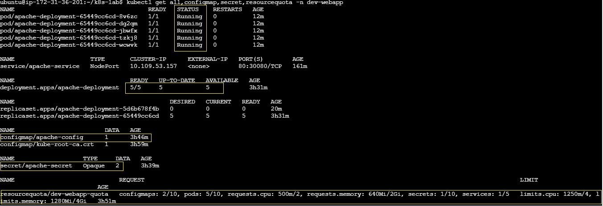

---

## Cleanup (optional)

When you're done practicing, remove everything in one shot by deleting
the namespace — this cascades and deletes every object inside it:

```bash
kubectl delete namespace dev-webapp
```

Verify it's gone:

```bash
kubectl get namespaces
```

---

## Summary of Objects Created

| Object | Name | Purpose |
|---|---|---|
| Namespace | `dev-webapp` | Isolates all Dev team resources |
| ResourceQuota | `dev-webapp-quota` | Caps CPU/memory/object counts |
| ConfigMap | `apache-config` | Supplies custom `index.html` |
| Secret | `apache-secret` | Stores admin credentials |
| Deployment | `apache-deployment` | Runs & manages Apache pods |
| Service | `apache-service` | Stable internal access to the pods |

## Key kubectl Commands Reference

| Task | Command |
|---|---|
| Scale | `kubectl scale deployment <name> -n <ns> --replicas=<n>` |
| Update image | `kubectl set image deployment/<name> <container>=<image> -n <ns>` |
| Rollout status | `kubectl rollout status deployment/<name> -n <ns>` |
| Rollout history | `kubectl rollout history deployment/<name> -n <ns>` |
| Rollback | `kubectl rollout undo deployment/<name> -n <ns>` |
| Rollback to revision | `kubectl rollout undo deployment/<name> -n <ns> --to-revision=<n>` |

## Part of
 
This repository is part of the **#AWSDevOpsRestartJourney** — a structured series of hands-on DevOps projects built and documented to strengthen core cloud and infrastructure skills.
 
---
 
## Author
 
**Sinsha C**
 
[](https://github.com/sinsha-c)
[](https://linkedin.com/in/sinshac)

---